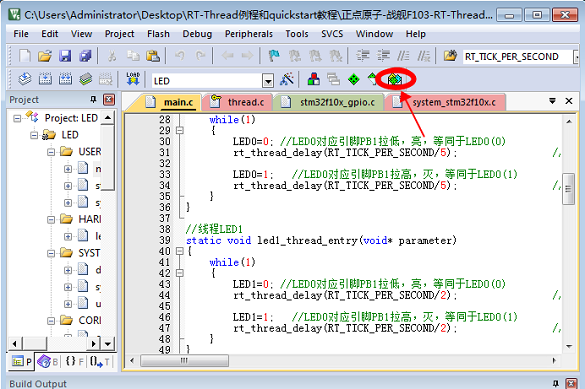
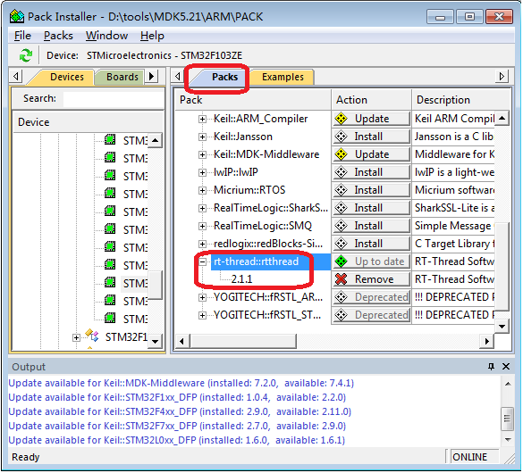
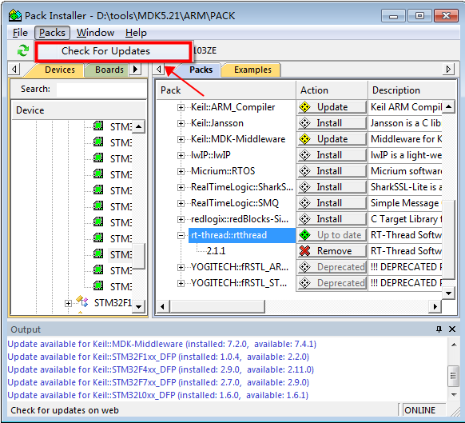
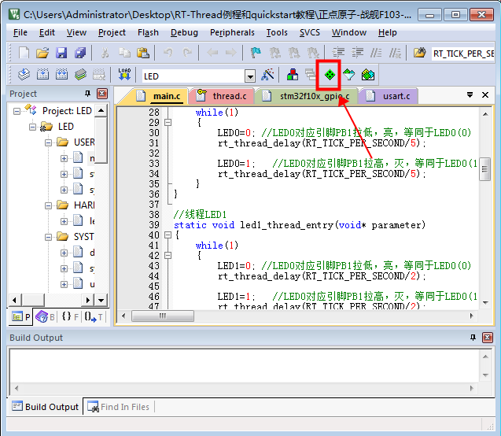
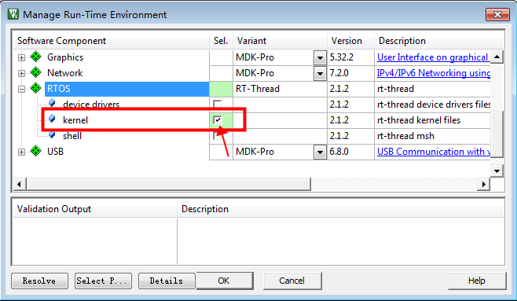
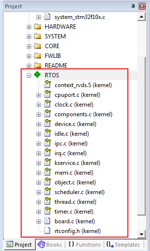
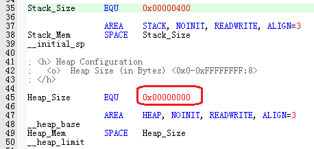
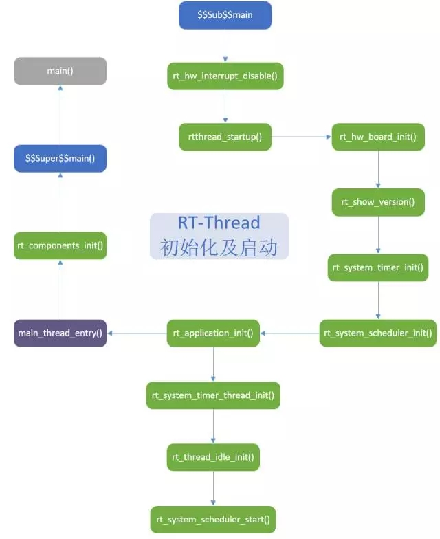
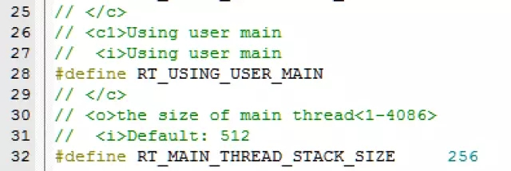

# 正点原子 Nano 入门环境搭建  #

何为RT-Thread Nano?大家知道，Keil5以后采用pack形式管理芯片及各种相关组件的。RT-Thread Nano就是通过Keil pack方式发布，在保持原有RT-Thread基本功能的情况下，实现了极小的Flash和RAM占用。默认配置下，Flash可小至2.5K， RAM可以小至1K。

目前pack包含有kernel、shell（msh）、device drivers三部分功能，这3个功能可按实际使用情况按需加载。

本节以正点原子开发板为例，说明了如何使用Keil MDK的软件包管理工具安装RT-Thread Nano，在此基础上实现创建2个LED闪烁的静态线程的示例。

## 1.准备工作

* 安装好Keil MDK软件
* 正点原子开发板（其它的开发板类似）

## 2.操作步骤


#### 第一步：RT-Thread Nano Pack下载安装


-  打开正点原子任何一款开发板的跑马灯实验库函数版本（F1和F407为标准库，F429和F767为HAL库）。


- 在MDK5主界面上点击“Pack Install”按钮，即可进入Pack Install界面。

<center>  </center >  
<center> 图1 Pack Install </center >

-  在Pack Install界面下，RT-Thread Pack在右边栏中。如未下载，可点击“Install”下载；如已安装，版本有更新，将提示“Update”可更新。 

<center>  </center >
<center> 图2 Packs 安装 </center >

- 如果在图2界面“Packs”栏中未发现“RT-Thread”，我们可以通过两种方法获取RT-Thread Pack。第一种方法是直接从[链接](http://www.rt-thread.org/download/mdk/rt-thread.rtthread.2.1.1.pack)
下载2.1.1版本的的RT-Thread Pack，然后双击完成安装。第二种方法是在菜单“Packs”下点击“Check for Updates”，Update需要一定的时间。Update完成后，将可看到RT-Thread Pack。Pack下载完成后Keil将自动弹出Pack安装界面，按步骤依次完成安装。

<center></center>
<center>图3 Packs下载和更新</center>

#### 第二步：kernel加载与应用

- 加载RT-Thread Kernel:在主界面点击“ManageRun-TimeEnvironment”按钮即可进入加载页。

<center></center>
<center>图4 RTE</center>

- 在“RTOS”一栏中选中“RT-Thread”，并在列表中选中“kernel”，当前版本为2.1.2。

<center></center>
<center>图5 加载内核</center>

- 确定后，keil界面上会加载RT-Thread的kernel文件，会根据当前选择芯片类型加入已移植完成的芯片内核代码、配置文件等。

<center></center>
<center>图6 内核文件</center>

> 其中，Kernel文件包括：

```
clock.c
components.c
device.c
idle.c
ipc.c
irq.c
kservice.c
mem.c
object.c
scheduler.c
thread.c
timer.c

```
> Cortex-M芯片内核移植代码：

```
cpuport.c
context_rvds.s

```

> 应用代码及配置文件：

```

board.c
rtconfig.h

```

#### 第三步：修改源码适配开发板

- 此时再次编译工程，编译器会提示有函数被重复定义了。需按照如下方式做一些修改：

> 修改stm32fXXXX_it.c文件（stm32f103对应的文件为stm32f10x_it.c，stm32f4对应的文件为stm32f4xx_it.c，stm32f7对应的文件为stm32f7xx_it.c），删除如下函数：

```
void HardFault_Handler(void);

void PendSV_Handler(void);

void SysTick_Handler(void);

```

> 按照应用代码board.c上的说明，依次修改相关代码：

修改第24行：

如果是F10，则`#include “stm32f10x.h” `

如果是F4， 则`#include “stm32f4xx.h”`

如果是F7，则`#include “stm32f7xx.h”`

修改48行：

在`rt_hw_board_init()`函数内开启Systick：

`SysTick_Config(SystemCoreClock /RT_TICK_PER_SECOND);`

修改66行：

引入Systick中断服务函数（注意，整个函数的注释都取消）：
```
    void SysTick_Handler(void)
     {
    	  /* enter interrupt */ 	  
    	  rt_interrupt_enter();

    	  rt_tick_increase();

    	  /* leave interrupt */   	  
    	  rt_interrupt_leave();
     }
```
> 这里特别提醒，对于使用HAL库的阿波罗F429或者F767，我们还应该
在rt_hw_board_init函数开头部分初始化HAL库和系统时钟：

    HAL_Init();                   //初始化HAL库  
    Stm32_Clock_Init(360,25,2,8); //设置时钟,180Mhz  这里是以F429为例

> 具体代码请参考对应的工程。

- 修改启动文件，设置堆大小为0。因为后续我们将采用RT-Thread管理内存堆。
打开芯片对应的启动文件，例如是stm32f103，启动文件为：startup_stm32f10x.s

<center></center>
<center>图7 堆修改</center>

- 最后，修改main.c文件，加入RT-Thread测试代码:

```
	#include "sys.h"
    #include "led.h"
    #include <rtthread.h>

	static struct rt_thread led0_thread;            //线程控制块
	static struct rt_thread led1_thread;            //线程控制块
	ALIGN(RT_ALIGN_SIZE)
	static rt_uint8_t rt_led0_thread_stack[1024];   //线程栈
	static rt_uint8_t rt_led1_thread_stack[1024];   //线程栈
  
	//线程LED0
	static void led0_thread_entry(void* parameter)
	{
		while(1)
		{
			LED0=0;  
			rt_thread_delay(RT_TICK_PER_SECOND/5);   //延时

			LED0=1; 
			rt_thread_delay(RT_TICK_PER_SECOND/5);   //延时
		}
	}
  
	//线程LED1
	static void led1_thread_entry(void* parameter)
	{
		while(1)
		{
			LED1=0;   
			rt_thread_delay(RT_TICK_PER_SECOND/2);   //延时

			LED1=1;
			rt_thread_delay(RT_TICK_PER_SECOND/2);   //延时
		}
	}
  
	int main(void)
	{
  
	//初始化LED 
	LED_Init();

	//创建静态线程
	rt_thread_init(&led0_thread,      //线程控制块
	"led0",                           //线程名字，在shell里面可以看到
	led0_thread_entry,                //线程入口函数
	RT_NULL,                          //线程入口函数参数
	&rt_led0_thread_stack[0],         //线程栈起始地址
	sizeof(rt_led0_thread_stack),     //线程栈大小
	3,                                //线程的优先级
	20);                              //线程时间片
   
	rt_thread_startup(&led0_thread);  //启动线程led0_thread，开启调度
   
	//创建静态线程
	rt_thread_init(&led1_thread,      //线程控制块
	"led1",                           //线程名字，在shell里面可以看到
	led1_thread_entry,                //线程入口函数
	RT_NULL,                          //线程入口函数参数
	&rt_led1_thread_stack[0],         //线程栈起始地址
	sizeof(rt_led1_thread_stack),     //线程栈大小
	3,                                //线程的优先级
	20);  
  
	rt_thread_startup(&led1_thread);  //启动线程led1_thread，开启调度

	}
```

该例程通过`rt_thread_init`函数创建两个静态线程led0和led1，对应线程入口函数分别为`led0_thread_entry`和`led1_thread_entry`，这两个函数分别控制LED0和LED1的状态翻转。然后程序通过`rt_thread_startup`函数分别启动这两个线程。最后我们通过ST-LINK将程序下载到开发板，可以看到LED0和LED1轮流翻转。
如有实验现象不一致，请参考对应开发板配套源码。

[源码和文档百度网盘下载](http://pan.baidu.com/s/1sl4sWjj)

## 3. RT-Thread程序执行流程分析

### RT-Thread入口

我们可以在`components.c`文件的140行看到`#ifdef RT_USING_USER_MAIN`宏定义判断，这个宏是定义在`rtconfig.h`文件内的，而且处于开启状态。同时我们可以在146行看到`#if defined (__CC_ARM)`的宏定义判断，`__CC_ARM`就是指keil的交叉编译器名称。

我们可以在这里看到定义了2个函数：`$$Sub$$main()`和`$$Super$$main()`函数；这里通过`$$Sub$$main()`函数在程序就如主程序之前插入一个例程，实现在不改变源代码的情况下扩展函数功能。链接器通过调用`$$Sub$$Main()`函数取代`main()`，然后通过`$$Super$$main`再次回到`main()`。

```
#if defined (__CC_ARM)
extern int $Super$$main(void);

/* re-define main function */

int $Sub$$main(void)
{
    rt_hw_interrupt_disable();
    rtthread_startup();
    return 0;
}

```

在`$$Sub$$main`函数内调用了`rt_hw_interrutp_disable()`和`rtthread_startup()`两个函数。熟悉RT-Thread开发流程的，一看就知道这是标准的RT-Thread的启动入口。
其中，`rt_hw_interrupt_disable()`是关中断操作；`rtthread_startup()`完成了systick配置、timer初始化/启动、idle任务创建、应用线程初始化、调度器启动等工作。

```
int rtthread_startup(void)
{
    rt_hw_interrupt_disable();
  
    /* board level initalization
     * NOTE: please initialize heap insideboard initialization.
     */
    rt_hw_board_init();
  
    /* show RT-Thread version */
    rt_show_version();
  
    /* timer system initialization */
    rt_system_timer_init();
  
    /* scheduler system initialization */
    rt_system_scheduler_init();
  
    /* create init_thread */
    rt_application_init();
  
    /* timer thread initialization */
    rt_system_timer_thread_init();
  
    /* idle thread initialization */
    rt_thread_idle_init();
  
    /* start scheduler */
    rt_system_scheduler_start();
  
    /* never reach here */
    return 0;
}

```

>几个函数说明如下：

| 函数名                        | 描述           |
|-------------------------------|----------------|
| rt_hw_board_init()            | 板级硬件初始化 |
| rt_system_timer_init()        | timer初始化    |
| rt_system_timer_thread_init() | timer启动      |
| rt_thread_idle_init()         | idle任务创建   |
| rt_application_init()         | 应用线程初始化 |
| rt_system_scheduler_start()   | 调度器启动     |

### 应用线程入口

`rt_application_init()`源码如下：

```
void rt_application_init(void)
{
    rt_thread_t tid;
  
#ifdef RT_USING_HEAP
    tid = rt_thread_create("main",main_thread_entry, RT_NULL,
    RT_MAIN_THREAD_STACK_SIZE,RT_THREAD_PRIORITY_MAX / 3, 20);
    RT_ASSERT(tid != RT_NULL);
#else
    rt_err_t result;
    tid = &main_thread;
    result = rt_thread_init(tid,"main", main_thread_entry, RT_NULL,main_stack, sizeof(main_stack),RT_THREAD_PRIORITY_MAX / 3, 20);
    RT_ASSERT(result == RT_EOK);
#endif
    rt_thread_startup(tid);
}

```

在这里，我们可以看到应用线程创建了一个名为`main_thread_entry`的任务，并且已经启动了该任务。我们再次来看一下`man_thread_entry`任务。

```

/* the system main thread */
void main_thread_entry(void*parameter)
{
    extern int main(void);
    extern int $Super$$main(void);
  
    /* RT-Thread components initialization */
    rt_components_init();
  
    /* invoke system main function */
#if defined (__CC_ARM)
    $Super$$main(); /* for ARMCC. */
#elif defined(__ICCARM__) ||defined(__GNUC__)
    main();
#endif
}

```

`man_thread_entry`任务完成了2个工作：调用`rt_components_init()`、进入应用代码真正的`main`函数。

在这里我们看到了`$$Super$$main()`的调用，在前面我们讲了调用该函数可用来回到`main()`的。

<center>  </center >  
<center> 图8 RT-Thread初始化及启动流程 </center >

从以上分析可以，正是由于在rtconfig.h内开启了`RT_USING_USER_MAIN`选项，编译器在`main`之前插入了`$$Sub$$main()`，完成了RT-Thread初始化及调度器启动工作。并且通过创建`main_thread_entry`任务，并通过`$$Super$$main()`回到`main()`函数。这样看来`main()`函数其实只是RT-Thread的一个任务，该任务的优先级为`RT_THREAD_PRIORITY_MAX / 3`，任务栈为`RT_MAIN_THREAD_STACK_SIZE`。

<center>  </center >  
<center> 图9 RT_USING_USER_MAIN选项 </center >


