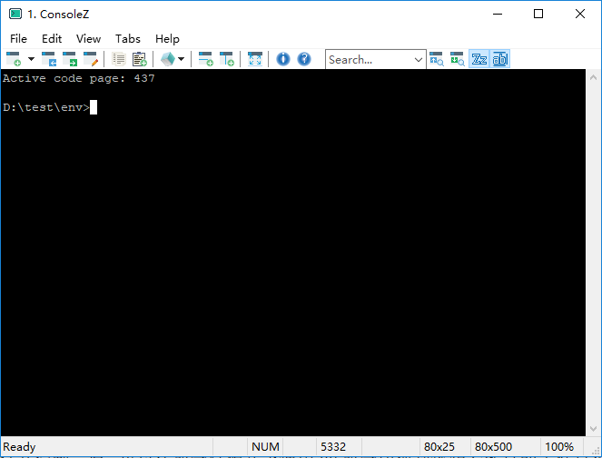
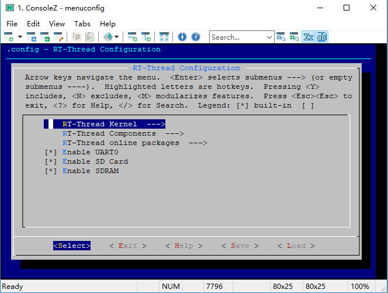
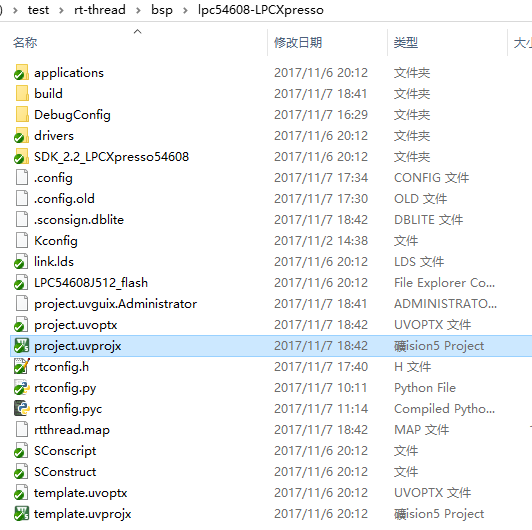
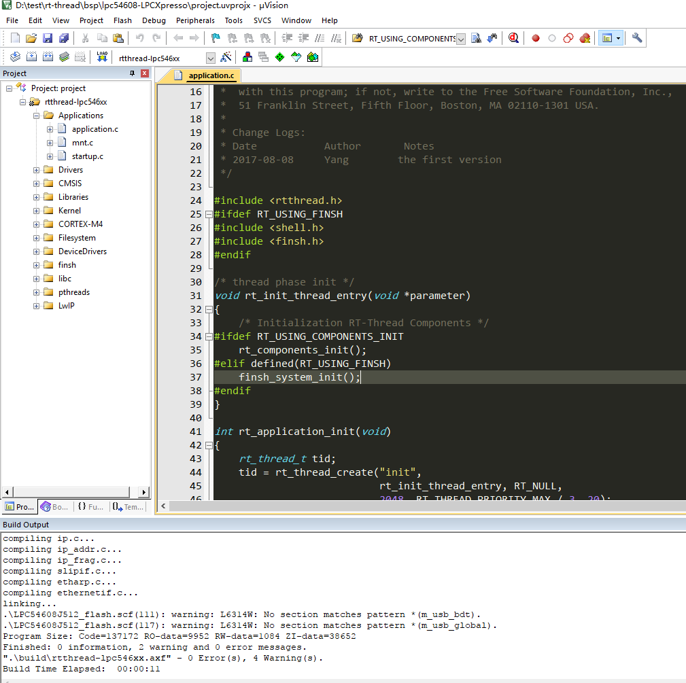
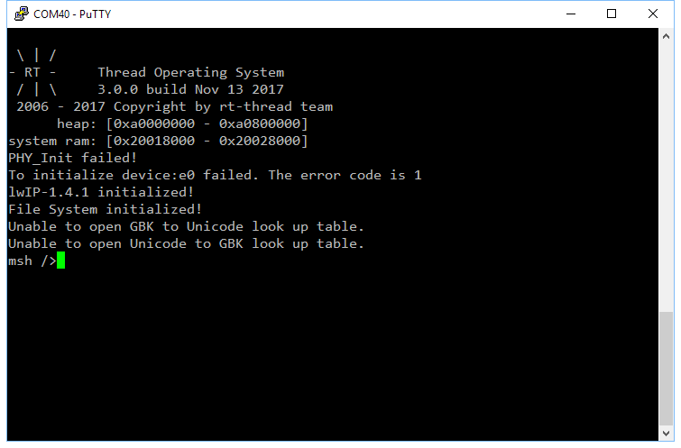
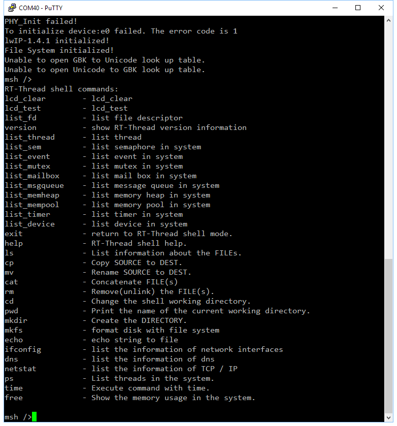
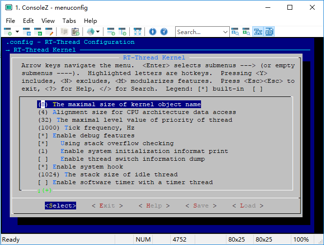

# LPC54608 IoT 环境搭建  #

本文以LPCXpresso54608开发板为例，说明了如何使用RT-Thread推出的env软件包管理工具裁剪配置RT-Thread ，使得系统以搭积木的方式进行构建，简单方便。

## 1.准备工作

- 安装好Keil MDK软件
- LPCXpresso54608开发板并安装好LPCScrypt驱动
- [下载env工具](http://www.rt-thread.org/page/download.html)
- [下载RT-Thread源码](https://github.com/RT-Thread/rt-thread)

## 2.操作步骤

#### 第一步：将下载的RT-Thread源码和env工具分别解压

  
  

 图1 准备源码和工具

####第二步：打开控制台

进入env目录，双击console.exe打开控制台

  
  

 图2 env控制台

然后在命令行模式下使用`cd`命令切换到工程目录`cd D:\test\rt-thread\bsp\lpc54608-LPCXpresso`

  
  

 图3 工程目录

####第三步：设置RTT_ROOT根目录

通过命令`set RTT_ROOT=your_rtthread_root_path`设置RTT_ROOT根目录

  
  

 图4 设置根目录

注意：RT-Thread不要放于带空格或中文字符的路径下

####第四步：更新仓库

使用`pkgs --upgrade`命令来更新env的组件包仓库列表

  
  

 图5 更新仓库

####第五步：裁剪配置RT-Thread

现在可以使用`menuconfig`命令进行项目配置了，控制台输入`menuconfig`将弹出如下界面

  
  

 图6 配置菜单

menuconfig提供了对RT-Thread内核、组件、在线软件包等的添加/删除，参数配置功能。

配置完毕后，输入`scons`命令即可完成基本的编译。

  
  

 图7 编译、生成工程命令

输入`scons --target=mdk5 -s`生成名为`project`的keil5工程。

  
  

 图8 keil工程

####第六步：使用keil编译、下载程序

使用keil打开`\rt-thread\bsp\lpc54608-LPCXpresso`目录下的`project.uvprojx`工程文件，可以看到，自动添加了所需的文件。

  
  

 图9 编译工程

####第七步：

点击编译按钮、下载程序，打开串口调试助手（115200-N-8）就可以看到RT-Thread成功运行的log了。

  
  

 图10 串口信息
