# LPC54608 IoT 环境搭建  #

本文以LPCXpresso54608开发板为例，说明了如何使用RT-Thread推出的env软件包管理工具裁剪配置RT-Thread ，使得系统以搭积木的方式进行构建，简单方便。

## 1.准备工作

- 安装好Keil MDK软件
- LPCXpresso54608开发板并安装好LPCScrypt驱动
- [下载env工具](http://www.rt-thread.org/page/download.html)
- [下载RT-Thread源码](https://github.com/RT-Thread/rt-thread)

## 2.操作步骤

#### 第一步：将下载的RT-Thread源码和env工具分别解压

建议将源码和env工具解压到同一个目录，如图1所示：

  
  

 图1 准备源码和工具

#### 第二步：打开控制台

进入env目录，双击console.exe打开控制台

  
  

 图2 env控制台

然后在命令行模式下使用`cd`命令切换到工程目录`cd D:\test\rt-thread\bsp\lpc54608-LPCXpresso`

 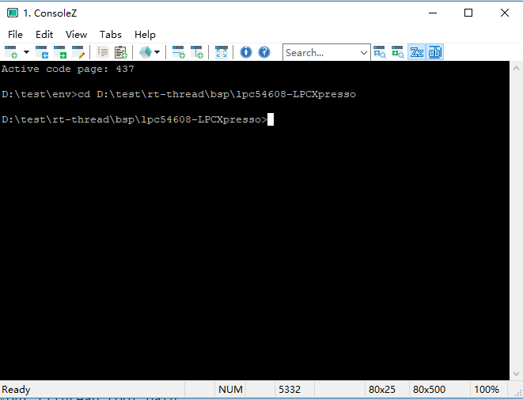 
  

 图3 工程目录

#### 第三步：使用menuconfig

现在可以使用menuconfig命令进行项目配置了，在控制台输入`menuconfig`将弹出如下界面：

  
  

 图4 menuconfig界面

默认启用了串口0作为调试输出，启用SD卡，外部SDRAM，一般来说，官方bsp已经配置好了大多数常用功能。

#### 第四步：生成keil工程

配置完毕后，输入`scons --target=mdk5 -s`会在相应的bsp根目录生成名为`project`的keil5工程。

 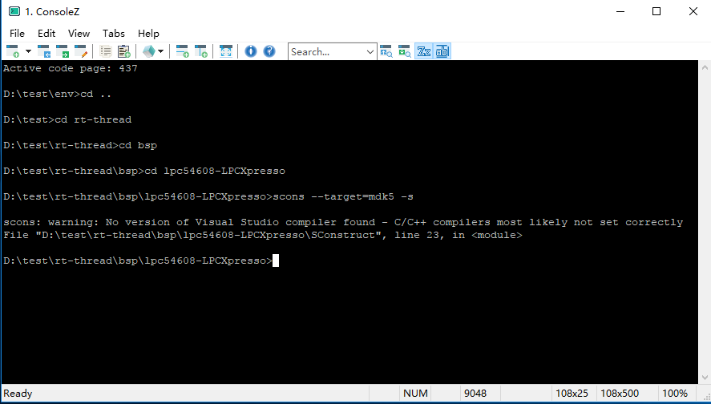 
  

 图5 生成工程命令

  
  

 图6 生成的keil工程

小编这里就使用keil打开`\rt-thread\bsp\lpc54608-LPCXpresso`目录下的`project.uvprojx`工程文件，可以看到文件已经自动添加好了。

  
  

 图7 使用keil打开工程

#### 第五步：烧录程序

点击编译按钮、下载程序，打开终端软件putty（115200-8-1-N）就可以看到RT-Thread成功运行的log了：

  
  

 图8 RT-Thread标志log

按下`Tab`键打印出功能命令列表，熟悉Linux的读者对这这样的命令行界面一定不会陌生。

  
  

 图9 类Linux终端命令

## 3.env配置详解

env提供了对RT-Thread内核、组件、在线软件包等的添加/删除，参数配置功能，下面详细介绍env强大的功能。

<table><tr><td bgcolor=Yellow>内核配置</td></tr></table>

在menuconfig界面选中RT-Thread Kernel进入内核配置子目录：

  
  

 图10 内核裁剪菜单

>注：左下角的绿色↓(＋)表示还有下一页，按↓键可向下翻页。

内核配置部分包括RT-Thread内核所有参数的配置，如心跳Tick、最大线程数、栈溢出检查、信号量、互斥锁、邮箱、消息队列、信号（3.0新特性）、钩子函数、内存管理策略、终端等。
我们以内核对象名最大长度的配置为例： 选中第一项，点击Enter进入详细页，我们把它改为12看看： 

 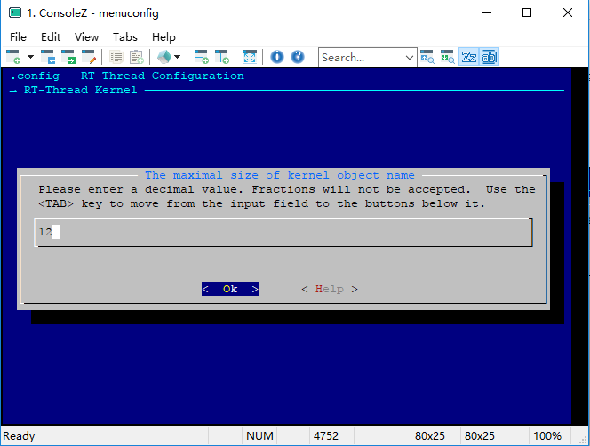 
  

 图11 对象名长度配置

点击Enter退出：

 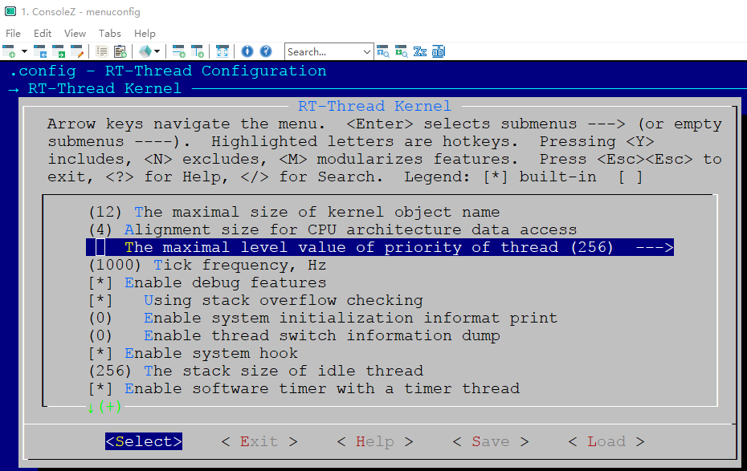 
  

 图12 保存退出

再把最大优先级数改为256，保存退出。这些参数其实就是RT-Thread配置文件rtconfig.h里面的，我们打开它可以看到和上面修改的一致：

 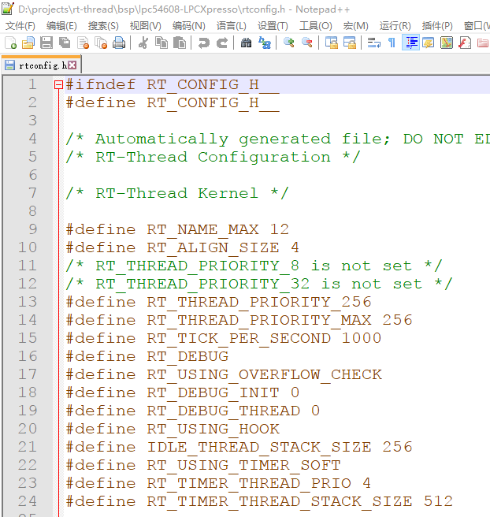 
  

 图13 rt-thread配置文件

其它参数的修改类似，实际中根据需要修改即可，即可达到裁剪、配置内核的目的。

<table><tr><td bgcolor=Yellow>组件配置</td></tr></table>

选中RT-Thread Components进入组件配置菜单：

 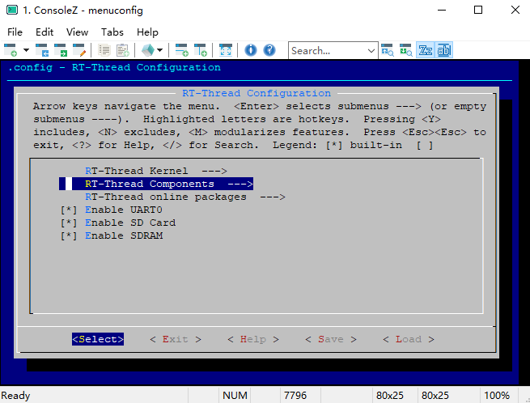 
  

 图14 组件配置

组件配置菜单提供了C++支持、shell、文件系统、设备驱动、POSIX和C标准库、网络协议栈、GUI等参数配置选项。

 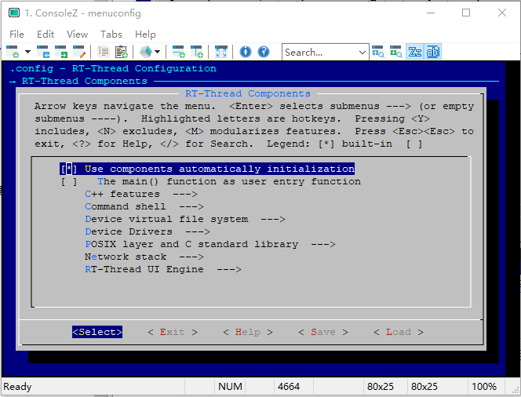 
  

 图15 组件配置菜单

命令行shell工具提供了类似linux的终端，在使用方式和功能上非常“Linux”，通过一个串口终端软件就能十分方便查看系统参数，与操作系统内核交互。

 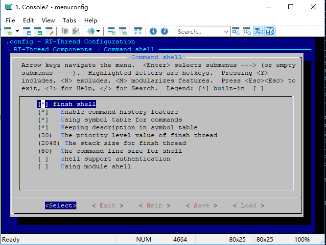 
  

 图16 命令行配置

RT-Thread提供专门优化过的虚拟文件系统（接口），支持众多文件系统格式，例如个人电脑上常使用的FAT 文件系统，或者是嵌入式设备中常见的flash 文件系统（YAFFS2、JFFS2 等）、FatFS，ROMFS以及网络文件系统NFS v3。

 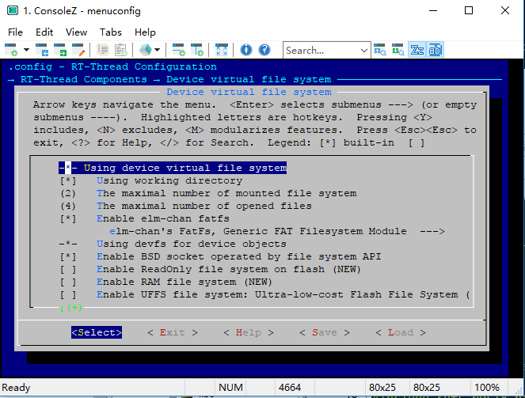 
  

 图17 文件系统配置

RT-Thread团队编写了常用通信接口的驱动，如I2C、SPI、CAN、Nand/Nor Flash等，需要什么只需一键添加，无需用户移植。此外，针对具体的芯片、电子模块，RT-Thread发布了大量的应用笔记、例程，方便用户快速实现自己的业务逻辑而不是把时间耗费在底层软件的开发移植上。

 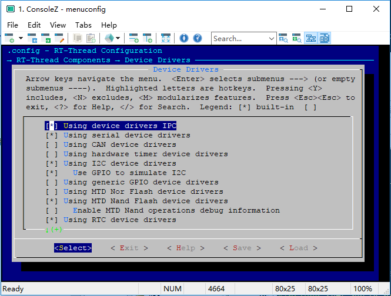 
  

 图18 设备驱动配置

RT-Thread还有一大亮点是支持POSIX接口标准，提高了应用程序的兼容性。

 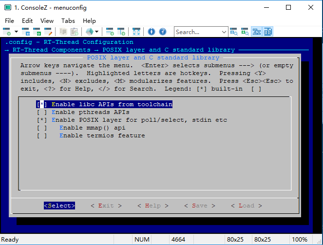 
  

 图19 POSIX支持配置

网络协议栈使用最为广泛的开源协议栈lwIP，支持TCP/IP，使用menuconfig能够方便的配置和裁剪IwIP。

 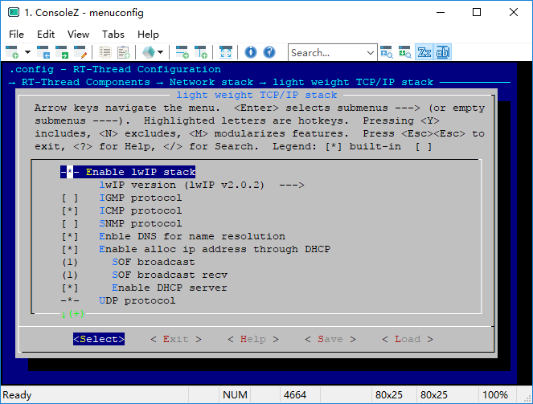 
  

 图20 网络配置

除了TCP/IP，还支持Modbus协议，Modbus协议采用了开源免费的freemodbus从机协议，在此基础上增加了主机协议（freemodbus只有从机开源免费，主机是收费的！）。

 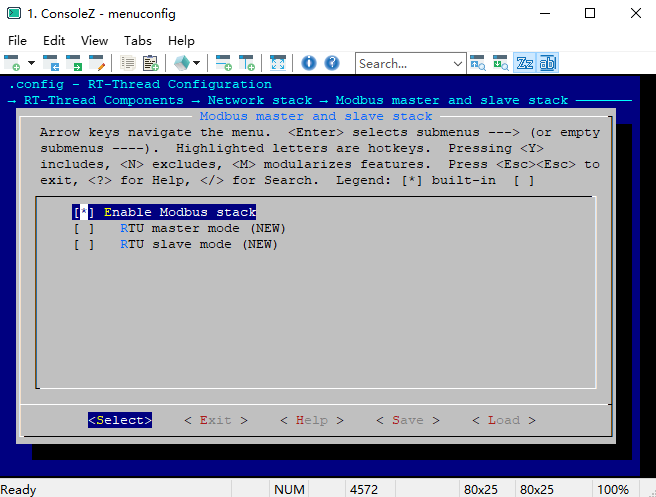 
  

 图21 modbus配置

<table><tr><td bgcolor=Yellow>在线组件包</td></tr></table>
RT-Thread支持在线组件包安装，即从RT-Thread下载所需的软件包到本地，包括轻量级数据库、IoT相关协议、脚本支持、日志记录和Cortex-M错误诊断工具等。

 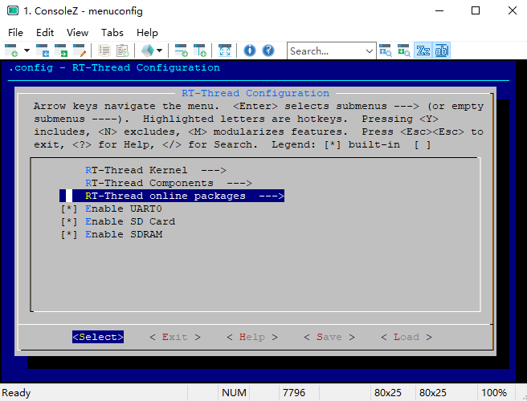 
  

 图22 在线组件包

系统组件包含有一个轻量级的嵌入式关系型数据库SQLite。

 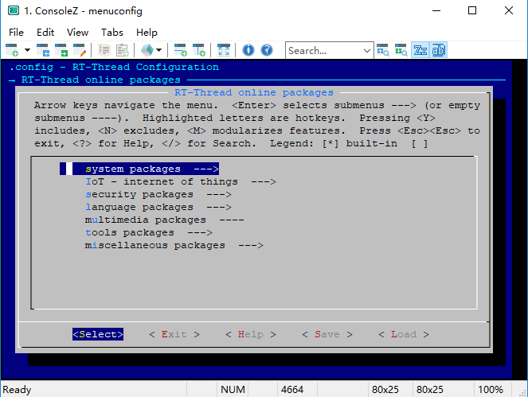 
  

 图23 系统组件包

 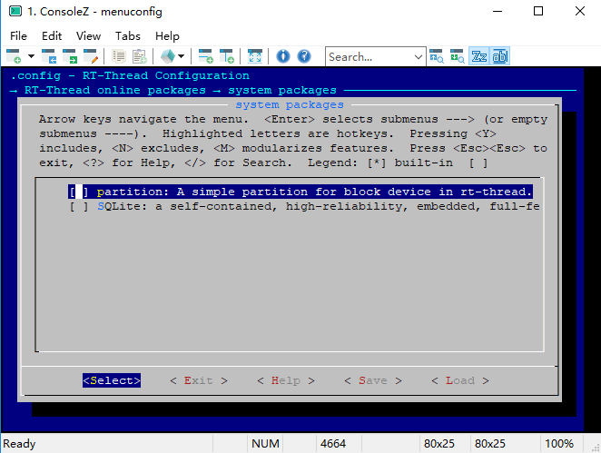 
  

 图24 数据库配置

IoT组件包含了物联网常用的通信协议，如MQTT、cJSON、ezXML等，只需一键即可添加到用户的系统中来，无需用户进行繁琐的底层移植，简便易用。

 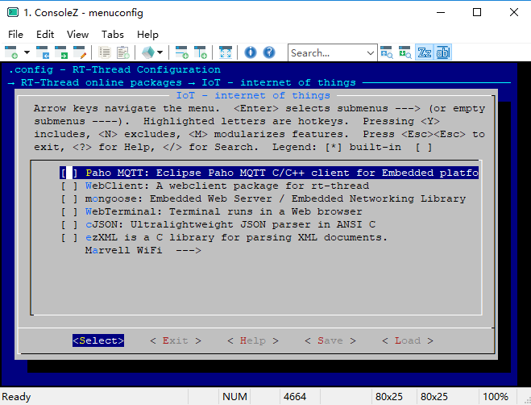 
  

 图25 IoT组件包

限于篇幅，rt-thread内核和组件配置就介绍到这里，更多资料敬请关注RT-Thread官方文档中心。
