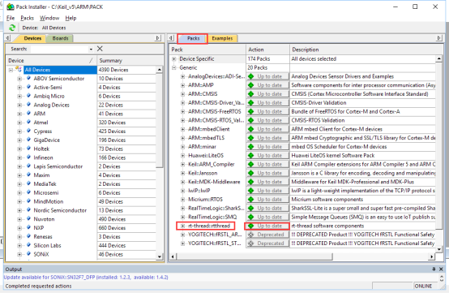
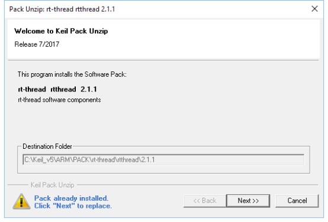
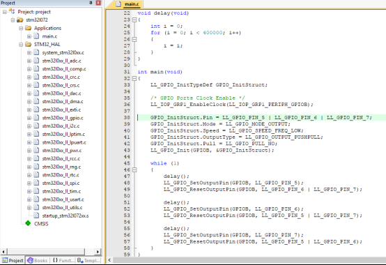
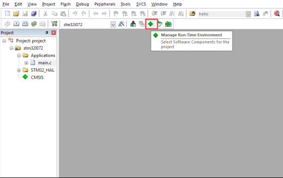
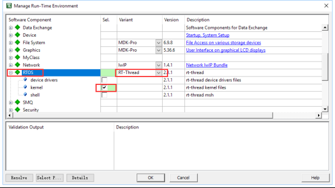
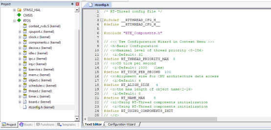
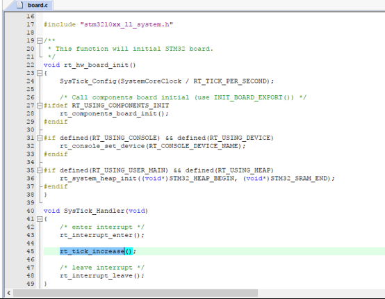
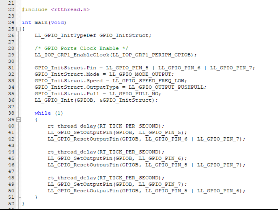
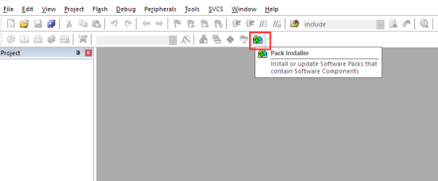
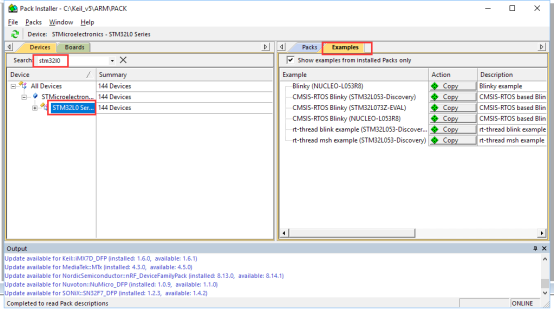

# RT-Thread Nano发布说明 #

RT-Thread Nano是一个精炼的硬实时内核，支持多任务处理、软件定时器、信号量、邮箱和实时调度等相对完整的实时操作系统特性，用户可以直接从MDK的Run-time Environment获取，可以使用shell高效地进行在线动态调试。
在支持semaphore和mailbox特性，并运行两个线程(main线程+idle线程)情况下，ROM和RAM依然保持着极小的尺寸。我们基于Cortex M0 MCU的一个例子，编译后的大小(ROM: 3.25K, RAM: 1.04K)，除去MCU需要的ROM和RAM， RT-Thread Nano本身需要的ROM是2.5K , RAM 是1K。

图1 RT-Thread Nano内存占用情况 

接下来将描述如何在MDK5上基于RTE(Run-Time Environment)， 从裸机开始，创建一个RT-Thread RTOS的小系统工程。
## 1. Pack安装 ##
Pack可以通过MDK联网安装，也可以离线安装。下面开始介绍两种安装方式。

- Pack Installer安装

打开MDK软件，点击工具栏的Pack Installer图标：

图2 Packs安装

点击右侧的Pack，展开General，可以找到rt-thread::rthread，点击对应的Action的Install，就可以在线安装Pack了。安装成功后Action栏显示 ”Up to date”。

图3 Packs管理

- 手动安装

我们也可以从官网下载安装文件，[RT-Thread Nano离线安装包下载](http://download.rt-thread.org/download/mdk/rt-thread.rtthread.2.1.1.pack)，双击下载好的文件进行安装：

图3 Packs手动安装

## 2. 基础工程准备 ##

在开始创建RT-Thread小系统之前，我们需要准备一个能正常运行的裸机工程。作为示例，这边使用的是基于STM32L072-Discovery 和Low-Level Library的一个LED 闪烁程序。程序的主要截图如下：

图4 STM32L072-Discovery示例

在我们的例程中，编译下载程序后，就可以看到3个LED交替闪烁了。读者可以根据自己的需要使用其他芯片，完成一个简单的类似裸机工程。

## 3. 添加RT-Thread到工程 ##

基于一个可以运行的裸机程序，我们来添加RT-Thread到工程。如下图，点击Manage Run-Time Environment。

图5 RTE

在Manage Rum-Time Environment里”Software Component”栏找到RTOS，Variant栏选择RT-Thread，然后勾选kernel。就可以将RT-Thread内核添加到工程了。点击”OK”就添加RT-Thread到工程了。

图6 内核添加

现在可以在Project看到RT-Thread RTOS已经添加进来了，展开RTOS，可以看到这些文件被添加到工程：

图7 添加了RTOS的工程

## 4. 适配RT-Thread ##

在board.c完成systick的配置。以STM32L072为例，需要添加以下代码：

1). 包含相应的头文件

2). 初始化Systick：根据系统频率和每秒tick数量，配置Systick

3). 在Systick中断处理函数里添加`rt_tick_increase()`函数

图8 配置systick

因为RT-Thread用到了异常处理函数`HardFault_Handler()`和悬挂处理函数`PendSV_Handler()`，所以用户代码需要保证这两个函数没有被使用。

最后替换掉上面例程的`delay`函数：

1). 包含RT-Thread的相关头文件`<rtthread.h>`

2). 将`delay()`函数替换成`rt_thread_delay(RT_TICK_PER_SECOND)`

下面是完成修改的代码：

图9 异常处理修改

编译程序之后下载到芯片就可以看到基于RT-Thread的程序运行起来了。

## 5. 更多例程 ##

更多参看例程可以在MDK上通过Pack Installer找到。点击Pack Installer图标：

图10 pack installer

我们可以在Search里输入stm32l0，点击Device里的STM32L0 Serials，然后点击右侧的Example，可以看到右侧有基于stm32l0的两个例程。

图11 例程

