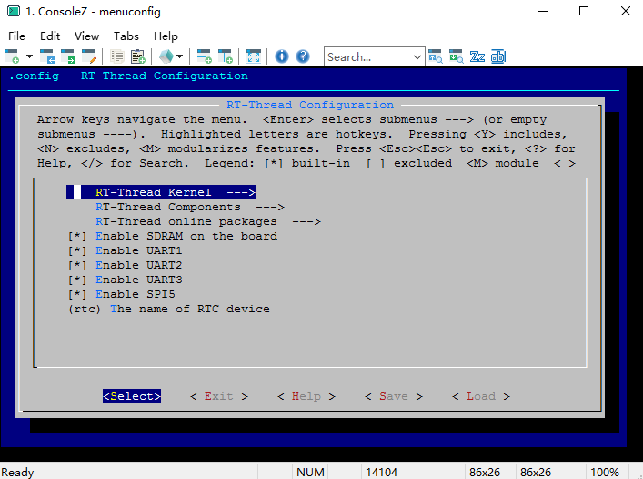

[TOC]
# env工具使用手册

---

## 1.介绍

env是RT-Thread推出的辅助工具，用来配置基于RT-Thread操作系统开发的项目工程。

env工具提供了简单易用的配置剪裁工具，用来对内核和组件的功能进行配置，对组件进行自由裁剪，使系统以搭积木的方式进行构建。

## 1.1 主要特性
- menuconfig图形化配置界面，交互性好，操作逻辑强；
- 丰富的文字帮助说明，配置无需查阅文档；
- 使用灵活，自动处理依赖，功能开关彻底；
- 自动生成rtconfig.h，无需手动修改；
- 使用scons工具生成工程，提供编译环境，操作简单；
- 提供多种组件包，模块化组件包耦合关联少，可维护性好；
- 组件包可在线下载，软件包持续集成，包可靠性高；
## 1.2 准备工作
env工具包含了RT-Thread源代码开发编译环境和组件包管理系统。

* env环境编译器默认使用GNU GCC，工具链目录默认设置为 `env\tools\gnu_gcc\arm_gcc\mingw\bin`。版本为：gcc version 5.4.1 20160919 (release)。

* 在电脑上装好git，git的下载地址为`https://git-scm.com/downloads`,根据向导正确安装git，并将git添加到系统环境变量。组件包管理功能需要git的支持。

* 注意在工作环境中，所有的路径都不可以有中文字符或者空格。

## 2.打开env控制台

RT-Thread 软件包环境主要以命令行控制台为主，同时以字符型界面来进行辅助，使得尽量减少修改配置文件的方式即可搭建好RT-Thread开发环境的方式。

进入env目录，可以运行本目录下的`console.exe`，如果打开失败可以尝试使用`console.bat`，它会配置一些环境变量，然后弹出控制台窗口。接下来对软件包的操作都是在控制台环境下进行的，下图为控制台窗口：

    因为需要设置env进程的环境变量，第一次启动可能会出现杀毒软件误报的情况，如果遇到了杀毒软件误报，允许console运行，然后将console添加至白名单即可。这个问题正在修复当中。

## 3.env的使用方法
### 3.1 使用步骤

#### 第一步：切换到工程目录

打开控制台后，可以在命令行模式下使用cd命令切换到你想要配置的工程目录。

例如工程目录为:`rt-thread\bsp\stm32f429-apollo`，在命令行下使用cd命令切换到的bsp根目录。如果env和rt-thread不在一个盘符，可以先使用`e:`或者`d:`命令切换盘符，然后再使用cd命令。

#### 第二步：更新env的在线组件包仓库列表

在使用`menuconfig`命令之前还需要使用

    pkgs --upgrade

命令来更新env的组件包仓库列表。（无需每次更新，需要查看最新包列表时更新即可。）

#### 第三步：使用menuconfig开始配置项目

现在就可以在设备工程目录中使用`menuconfig`命令开始进行项目配置，如果没有出错接下来就可以看到`menuconfig`的界面了，如下图：

使用`menuconfig`命令打开配置图形界面来配置rt-thread，可以在界面中可以看到和RT-Thread相关的配置项。

选择好配置项之后按ESC键退出，选择保存修改即可自动生成rtconfig.h文件。

如果修改了`RT-Thread online packages`内的选项，想要下载在线组件包，可以使用`pkgs --update`命令来下载或者更新设置。

### #第四步：BSP的编译

env也携带了`Python & scons`环境，只需在`rt-thread\bsp\stm32f429-apollo` 目录中运行：

    scons
即可使用默认的ARM_GCC工具链编译RT-Thread了,scons操作和常规使用方法是相同的。

编译成功：

### 3.2 menuconfig的简单使用方法：

- 上下键：选择不同的行，移动到不同的（每一行的）选项上。

- 空格键：用于在选择该选项，取消选择该选项，之间来回切换。

  - 选择该（行所在的）选项：对应的该选项前面就变成了，中括号里面一个星号，即 **[ \* ]**，表示被选中了。
  - 如果是取消该选项，就变成了，只有一个中括号，里面是空的，即：[   ]

- 左右键：用于在Select/Exit/Help之前切换

- 回车键：左右键切换到了某个键上，此时回车键，就执行相应的动作：

  - Select：此时一般都是所在（的行的）选项，后面有三个短横线加上一个右箭头，即 —>，表示此项下面还有子选项，即进入子菜单
  - Exit：直接退出当前的配置，当你更改了一些配置，但是又没有保存，此时会询问你是否要保存当前（已修改后的最新的）配置，然后再退出。
  - Help：针对你当前所在某个（行的）选项，查看其帮助信息。如果你对某个选项的功能不是很清楚就可以查看其Help，也可以可能查到写出到配置文件中的宏。

### 3.3 使用menuconfig配置自己工程的方法

本章描述如何使用menuconfig来配置自己工程，正在完善中。

#### 3.3.1 构建工程流程

第一步：根据Kconfig的内容生成可视化配置菜单（使用menuconfig命令）。

第二步：配置完毕，保存退出可视化菜单生成.config文件。

第三步：根据.config的内容生成rtconfig.h文件。

第四步：SConscript根据rtconfig.h中定义的宏决定哪些文件参与工程构建。

#### 3.3.2 修改Kconfig 添加可视化配置选项

修改Kconfig的过程，可以认为是构建流程的逆向过程。

第一步：从SConscript中查找需要添加进工程的文件对应的控制宏，修改Kconfig时会用到。

以stm32f10x工程为例：需要添加core_cm3.c到工程，该文件由宏`RT_USING_BSP_CMSIS`所控制（见rt-thread\bsp\stm32f10x\Libraries\SConscript）。

第二步：确定修改哪个目录下的Kconfig文件。

以stm32f10x工程为例：core_cm3.c属于BSP中的文件，期待配置选项出现在`BSP DRIVERS`配置目录下，则需要修改rt-thread\bsp\Kconfig。

第三步：修改Kconfig。

以stm32f10x工程为例：打开rt-thread\bsp\Kconfig文件，找到`menu "BSP DRIVERS"`,在下一行填写`config RT_USING_BSP_CMSIS`和`其他的配置辅助信息`（见下图），重新menuconfig则可视化配置界面出现刚才添加的配置选项。

## 4.包管理器

### 4.1包管理器介绍

包管理器是一个组件包平台，用户可以通过包管理器来获取，添加或者删除自己所需要的组件包。还可以提供自己使用的组件包到平台来。通过包管理器的`pkgs --wizard`可以制作组件包下载索引，提交组件包下载索引到如下地址即可将自己制作的组件包发布出来：

    https://github.com/RT-Thread/packages.git

组件包代码本身可以存储在自己的网络存储空间，也可以提交到The packages repositories of RT-Thread中审核并管理，地址如下：

    https://github.com/RT-Thread-packages

目前支持的组件包格式有`.zip,.rar.gz,rar.bz2`。同时支持托管在git上，并且附带有submudule的组件包。比如mqtt组件包的地址为`https://github.com/RT-Thread-packages/paho-mqtt.git`。

### 4.2包管理器命令

包管理器的操作主要使用pkgs命令，可以使用 `pkgs -h`来获取使用帮助。 注意：在使用menuconfig选择在线包之前，需要先使用` pkgs --upgrade` 命令更新env的packages文件夹。请预先在电脑上装好git工具。

    pkgs --list            列出当前使用的组件包列表
    pkgs --update          读取目前menuconfig对项目的配置，和旧的项目配置做对比，然后更新组件包
    pkgs --wizard          组件包制作向导，根据提示输入来制作包向导文件夹
    pkgs --upgrade         从reposource更新env的本地packages文件夹
    pkgs --printenv        打印出当前环境的环境变量，可以检查是否配置正确
    example：
    使用pkgs --upgrade命令后，env环境会自动从默认git地址： `https://github.com/RT-Thread/packages.git` 来更新本地包。后续会支持更新源列表。

使用menuconfig来配置项目所需要的组件包，然后通过pkgs --update命令来更新项目中的组件包。如果不想要某个组件包，可以在menuconfig的配置中去掉包选项，然后再次使用`pkgs --update`命令更新即可。

#### 1.选中所需组件包：

#### 2.按下esc键退出选择yes按下回车即可保存本次配置：

#### 3.使用pkgs --update命令进行更新：

此时bsp中的packages文件夹里就会配置里选择下载的组件了，尝试使用scons工具编译或者生成工程吧。

如果想要去除某个组件包，只需要重新进入`menuconfig`，去掉软件包的勾选，然后再次使用`pkgs --update`命令更新即可。

如果解压出的组件包被人为修改，那么在删除组件包的时候会提示是否要删除被修改的文件。如果选择保留文件，那么请自行保存好这些文件，避免在下次更新包时被覆盖。

支持在线下载的组件包在RT-thread online packages选项中，根据项目需要来选择所需的组件。目前提供了不同类型的组件包以供测试。

## 5.编译RT-Thread

### 5.1 scons编译工具链的配置

### 5.2 开始编译工程吧

RT-Thread 软件包环境也携带了Python & scons环境，所以只需要在设备工程目录中运行：

    scons

就可以编译RT-Thread了。一般来说，工程所需要的环境变量都会在控制台环境中已经配置好。

## 6.高级篇
### 6.1如何制作一个组件包
### 6.2如何制作一个组件包下载索引
#### 6.2.1 制作一个git形式的组件包下载索引
使用命令`pkgs --wizard`开始制作组件包下载索引：

接下来需要输入组件包的名字，请使用小写字母组合的形式来给组件包取名。本次示例我们制作一个`pahomqtt`的组件包。

分为五步操作，首先输入组件包的名称，注意使用小写字母的组合，menuconfig选项名，版本号和第三个keyword在第一次制作的时候都可以按下回车使用默认值，最后根据提示为这次制作的软件包选择一个类别。因为本次制作的是iot类的组件包，所以输入1后按下回车，包下载索引就制作完成了。

在使用`pkgs --wizard`命令的目录找到生成的文件夹pahomqtt。

进入pkginfo目录：

这里的Kconfig和package.json就是我们重点需要关注的文件了。kconfig内容文件如下：

package.json文件内容如下：

本次示例所用的组件包已经制作好并上传到了git上，地址如下：

然后找到标识这个版本的SHA值，填入json文件。

修改好的json文件如下：

到此组件包下载索引就制作完成了，接下来将pkginfo文件夹改名为组件包名：

接下来我们需要将组件包索引通过PR流程推送到`https://github.com/RT-Thread-packages`，我们需要将我们的组件包放在packages相应的文件夹下后再进行推送。

使用git进行PR的方法请参考：
    https://github.com/RTThread/rtthreadmanualdoc/blob/master/zh/9appendix/03_github.md

#### 6.2.2 制作一个压缩包形式的组件包下载索引

制作一个压缩包形式的组件包下载索引大体上和上面的操作步骤是相同的。唯一不同的地方在于json文件，一个压缩包形式的组件包json文件如下：

这样我们就制作好一个下载索引包了，如果还有不懂的地方可以参考已有的组件包，或者及时在群里提出来，我们会第一时间回答你的疑问，并且对env中存在的问题进行优化。谢谢你的参与。

