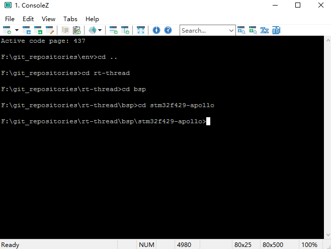
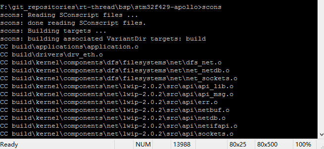
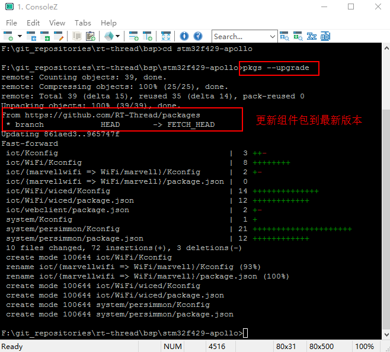

[TOC]
# env工具使用手册

---

## 1.介绍

env是RT-Thread推出的辅助工具，用来配置基于RT-Thread操作系统开发的项目工程。

env工具提供了简单易用的配置剪裁工具，用来对内核和组件的功能进行配置，对组件进行自由裁剪，使系统以搭积木的方式进行构建。

## 1.1 主要特性
- menuconfig图形化配置界面，交互性好，操作逻辑强；
- 丰富的文字帮助说明，配置无需查阅文档；
- 使用灵活，自动处理依赖，功能开关彻底；
- 自动生成rtconfig.h，无需手动修改；
- 使用scons工具生成工程，提供编译环境，操作简单；
- 提供多种软件包，模块化软件包耦合关联少，可维护性好；
- 软件包可在线下载，软件包持续集成，包可靠性高；
## 1.2 准备工作
env工具包含了RT-Thread源代码开发编译环境和软件包管理系统。

* env环境编译器默认使用GNU GCC，工具链目录默认设置为 `env\tools\gnu_gcc\arm_gcc\mingw\bin`。版本为：gcc version 5.4.1 20160919 (release)。

* 在电脑上装好git，git的下载地址为`https://git-scm.com/downloads`,根据向导正确安装git，并将git添加到系统环境变量。软件包管理功能需要git的支持。

* 注意在工作环境中，所有的路径都不可以有中文字符或者空格。

## 2.打开env控制台

RT-Thread 软件包环境主要以命令行控制台为主，同时以字符型界面来进行辅助，使得尽量减少修改配置文件的方式即可搭建好RT-Thread开发环境的方式。

进入env目录，可以运行本目录下的`console.exe`，如果打开失败可以尝试使用`console.bat`，它会配置一些环境变量，然后弹出控制台窗口。接下来对软件包的操作都是在控制台环境下进行的，下图为控制台窗口：

    因为需要设置env进程的环境变量，第一次启动可能会出现杀毒软件误报的情况，如果遇到了杀毒软件误报，允许console运行，然后将console添加至白名单即可。这个问题正在修复当中。

## 3.env的使用方法

### 第一步：切换到BSP根目录

- 打开控制台后，可以在命令行模式下使用cd命令切换到你想要配置的BSP根目录中。

例如工程目录为:`rt-thread\bsp\stm32f429-apollo`，在命令行下使用cd命令切换到的BSP根目录。如果env和rt-thread不在一个盘符，可以先使用`e:`或者`d:`命令切换盘符，然后再使用cd命令。

### 第二步：BSP的编译

- env中携带了`Python & scons`环境，只需在`rt-thread\bsp\stm32f429-apollo` 目录中运行`scons`命令即可根据`rtconfig.h`中的配置使用默认的ARM_GCC工具链编译BSP。

编译成功：

## 4. menuconfig的操作介绍
### 4.1 使用menuconfig配置工程

- 在设备工程目录中可以使用`menuconfig`命令对BSP的配置进行修改，可以看到`menuconfig`的界面，如下图：

使用`menuconfig`命令会读取当前目录下的`.config`文件，打开图形界面将`.config`文件中来配置项显示出来，可以在界面中可以看到和RT-Thread相关的配置项，此时的默认配置就是存储在`.config`文件中的。

选择好配置项之后按ESC键退出，选择保存修改即可自动生成rtconfig.h文件。

- 上下键：选择不同的行，移动到不同的（每一行的）选项上。
- 空格键：用于在选择该选项，取消选择该选项，之间来回切换。

  - 选择该（行所在的）选项：对应的该选项前面就变成了，中括号里面一个星号，即 **[ \* ]**，表示被选中了。
  - 如果是取消该选项，就变成了，只有一个中括号，里面是空的，即：[   ]
- 左右键：用于在Select/Exit/Help之前切换
- 回车键：左右键切换到了某个键上，此时回车键，就执行相应的动作：

  - Select：此时一般都是所在（的行的）选项，后面有三个短横线加上一个右箭头，即 —>，表示此项下面还有子选项，即进入子菜单
  - Exit：直接退出当前的配置，当你更改了一些配置，但是又没有保存，此时会询问你是否要保存当前（已修改后的最新的）配置，然后再退出。
  - Help：针对你当前所在某个（行的）选项，查看其帮助信息。如果你对某个选项的功能不是很清楚就可以查看其Help，也可以可能查到写出到配置文件中的宏。

### 4.2 直接使用已配置好的配置文件

对于一些BSP，可能BSP本身会提供多种配置，一般以`config`结尾。这个时候可以直接使用这份配置文件，而不需要再行通过menuconfig来一项项进行配置。

- 使用`menuconfig --config`命令后面加上存储的配置项可以选定配置文件并生成rtconfig.h文件。

  

## 5. 包管理器

### 5.1 包管理器介绍

包管理器是一个软件包平台，用户可以通过包管理器来获取，添加或者删除自己所需要的软件包。还可以提供自己使用的软件包到平台来。通过包管理器的`pkgs --wizard`可以制作软件包下载索引，提交软件包下载索引到如下地址即可将自己制作的软件包发布出来：

    https://github.com/RT-Thread/packages.git

软件包代码本身可以存储在自己的网络存储空间，也可以提交到The packages repositories of RT-Thread中审核并管理，地址如下：

    https://github.com/RT-Thread-packages

目前支持的软件包格式有`.zip,.rar.gz,rar.bz2`。同时支持托管在git上，并且附带有submudule的软件包。比如mqtt软件包的地址为`https://github.com/RT-Thread-packages/paho-mqtt.git`。

### 5.2 包管理器命令

包管理器的操作主要使用pkgs命令，可以使用 `pkgs -h`来获取使用帮助。 注意：在使用menuconfig选择在线包之前，需要先使用` pkgs --upgrade` 命令更新env的packages文件夹。请预先在电脑上装好git工具。

    pkgs --list            列出当前使用的软件包列表
    pkgs --update          读取目前menuconfig对项目的配置，和旧的项目配置做对比，然后更新软件包
    pkgs --wizard          软件包制作向导，根据提示输入来制作包向导文件夹
    pkgs --upgrade         从reposource更新env的本地packages文件夹,同时也会更新env自身的功能代码
    example：
    使用pkgs --upgrade命令后，env环境会自动从默认git地址： `https://github.com/RT-Thread/packages.git` 来更新本地包列表，同时升级自身的功能代码。后续会支持更新源列表。

#### 第一步：更新env的在线软件包仓库列表 (如果软件包列表已经更新，可忽略这步)

- 使用`pkgs --upgrade`命令来更新env的软件包仓库列表。

#### 第二步：配置所需的软件包

- 支持在线下载的软件包在RT-thread online packages选项中，使用menuconfig来选择项目所需要的软件包，然后通过pkgs --update命令来更新项目中的软件包。如果不想要某个软件包，可以在menuconfig的配置中去掉包选项，然后再次使用`pkgs --update`命令更新即可。

##### 1.选中所需软件包：

##### 2.按下esc键退出选择yes按下回车即可保存本次配置

##### 3.使用pkgs --update命令使配置生效

此时就会在线下载相应的软件包，并解压到bsp中的packages文件夹里。

如果想要去除某个软件包，只需要重新进入`menuconfig`，去掉软件包的勾选，然后再次使用`pkgs --update`命令更新即可。

如果解压出的软件包被人为修改，那么在删除软件包的时候会提示是否要删除被修改的文件。如果选择保留文件，那么请自行保存好这些文件，避免在下次更新包时被覆盖。

## 6.高级篇
### 6.1关于menuconfig的支持

- 目前RT-Thread还没有对所有的bsp做menuconfig的支持，也就是说有些bsp暂时还不能使用menuconfig来进行配置，这些BSP会逐渐完善起来。
  已经支持的bsp有`stm32f429-apollo,stm32f429-disco,lpc54608-LPCXpresso`等。

- menuconfig中选项的修改方法：
  如果想在menuconfig的配置项中添加宏定义，则可以修改bsp下的Kconfig文件，修改方法可以在网络中搜索`Kconfig语法`关键字获得详细的说明文档，也可以参考RT-Thread中的Kconfig文件或者已经支持过menuconfig的bsp中的Kconfig文件。

### 6.2如何制作一个软件包
### 6.3如何制作一个软件包下载索引
#### 6.3.1 制作一个git形式的软件包下载索引
使用命令`pkgs --wizard`开始制作软件包下载索引：

接下来需要输入软件包的名字，请使用小写字母组合的形式来给软件包取名。本次示例我们制作一个`pahomqtt`的软件包。

分为五步操作，首先输入软件包的名称，注意使用小写字母的组合，menuconfig选项名，版本号和第三个keyword在第一次制作的时候都可以按下回车使用默认值，最后根据提示为这次制作的软件包选择一个类别。因为本次制作的是iot类的软件包，所以输入1后按下回车，包下载索引就制作完成了。

在使用`pkgs --wizard`命令的目录找到生成的文件夹pahomqtt。

进入pkginfo目录：

这里的Kconfig和package.json就是我们重点需要关注的文件了。kconfig内容文件如下：

package.json文件内容如下：

本次示例所用的软件包已经制作好并上传到了git上，地址如下：

然后找到标识这个版本的SHA值，填入json文件。

修改好的json文件如下：

到此软件包下载索引就制作完成了，接下来将pkginfo文件夹改名为软件包名：

接下来我们需要将软件包索引通过PR流程推送到`https://github.com/RT-Thread/packages`，我们需要将我们的软件包放在packages相应的文件夹下后再进行推送。

使用git进行PR的方法请参考：
    https://github.com/RT-Thread/rtthread-manual-doc/blob/master/zh/9appendix/03_github.md

#### 6.3.2 制作一个压缩包形式的软件包下载索引

制作一个压缩包形式的软件包下载索引大体上和上面的操作步骤是相同的。唯一不同的地方在于json文件，一个压缩包形式的软件包json文件如下：

这样我们就制作好一个下载索引包了，如果还有不懂的地方可以参考已有的软件包，或在RT-Thread论坛中提出来，我们会第一时间回答你的疑问，并且对env中存在的问题进行优化。谢谢你的参与。
